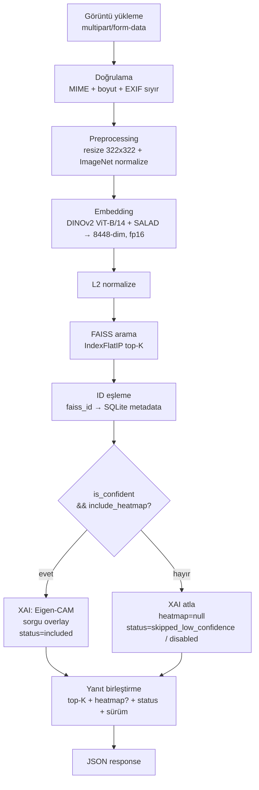
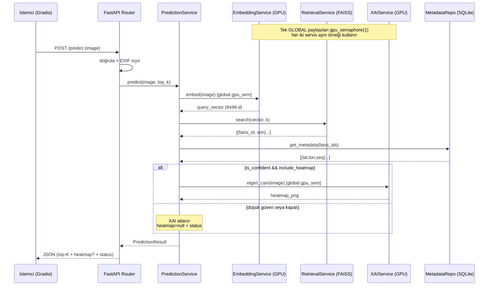
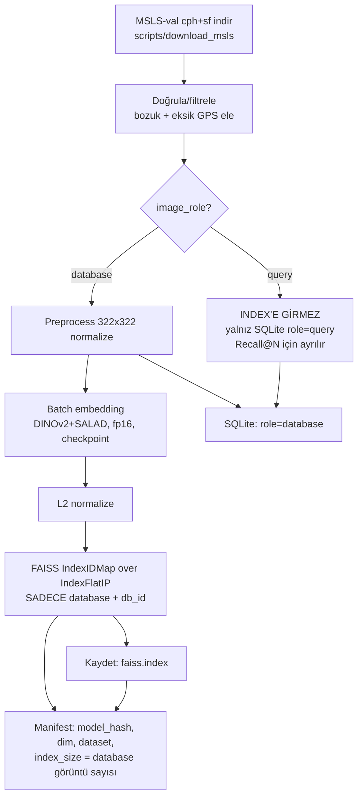

# MİM-2a: AI Pipeline Tasarımı

> Plan/dokümantasyon. Uygulama kodu içermez.

## Online Akış (sorgu anı)

> **Çözünürlük notu (322x322 zorunlu):** Resmi SALAD reposu (github.com/serizba/salad)
> eval script'i **322x322** kullanır ve MSLS-val R@1 %92.2 bu çözünürlükte alınmıştır.
> DINOv2 patch boyutu 14 → 322² **529 patch**, 224² yalnız 256 patch üretir; SALAD'ın
> 64-cluster optimal-transport aggregation'ı 529-patch dağılımıyla kalibre edilmiştir.
> Bu nedenle 224² sadece hafif doğruluk kaybı değil, **kalibrasyon uyumsuzluğu** yaratır.
> (Önceki 224² kararı düzeltildi.)

## Sequence (katmanlar arası)

## Offline Pipeline (referans DB → FAISS)

**Adımlar:** indir → doğrula (GPS'siz/bozuk ele) → **role'e göre ayır** → *database*: 224² normalize → batch embed (fp16+checkpoint, risk #24) → L2 normalize → `IndexIDMap`(IndexFlatIP, kosinüs) SADECE database + db_id → kaydet → manifest. *query*: index'e **hiç girmez**, yalnız SQLite'a (`role=query`) yazılır ve `evaluate.py` için ayrılır.

> **Data leakage önlemi (kritik):** Yalnızca `image_role='database'` görüntüler FAISS index'ine yazılır. `query` görüntüleri index'te bulunmadığından Recall@N ölçümü suni yüksek skora (kendisiyle eşleşme) düşmez. Bu, MİM-4 değerlendirme protokolünün geçerliliğinin ön koşuludur.

## Model Versiyonlama (risk #15)
`ml/model_registry.py` manifest: backbone+sürüm, SALAD sürümü, embedding_dim, preprocessing config, dataset sürümü, index build hash. Index adı hash içerir. Startup'ta hash uyuşmazsa → `ModelNotReadyError`.

## Sync/Async GPU Kuyruğu (risk #28)
| Alternatif | Değerlendirme |
|---|---|
| Doğrudan blocking | Event loop kilitlenir ✗ |
| Servis başına ayrı Semaphore(1) | ✗ embed+eigen_cam eşzamanlı → 8GB OOM riski |
| **Tek global paylaşılan Semaphore(1) + run_in_executor** | ✓ Sistem genelinde tek GPU işlemi, loop duyarlı, Redis yok |
| Celery+Redis | v2; MVP overkill |

**Öneri:** `app.state` içinde **tek global `gpu_semaphore = asyncio.Semaphore(1)`**; DI ile hem EmbeddingService hem XAIService'e **aynı örnek** enjekte edilir. Her GPU çağrısı bu semaphore'u alır → herhangi bir anda yalnızca bir GPU işlemi (embed *veya* eigen_cam) çalışır; iki eşzamanlı isteğin çakışması engellenir. `run_in_executor` (tek-thread pool) ile event loop duyarlı kalır. fp16 + 322² (küçük batch ayarıyla) → 8GB VRAM içinde (risk #20/#21).

> **Kritik:** Servis başına ayrı semaphore, "tek-worker serileştirme" hedefini kırar (embed ve eigen_cam paralel çalışıp OOM). Bu nedenle tek paylaşılan örnek zorunludur.

### MİM-2a Özeti
Uçtan uca pipeline (3 Mermaid), offline index inşası, hash-tabanlı versiyonlama, Semaphore(1) GPU serileştirme.
