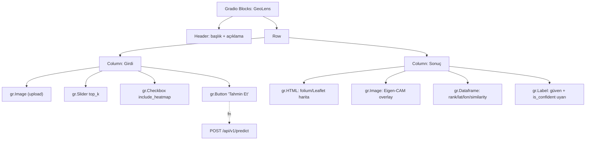
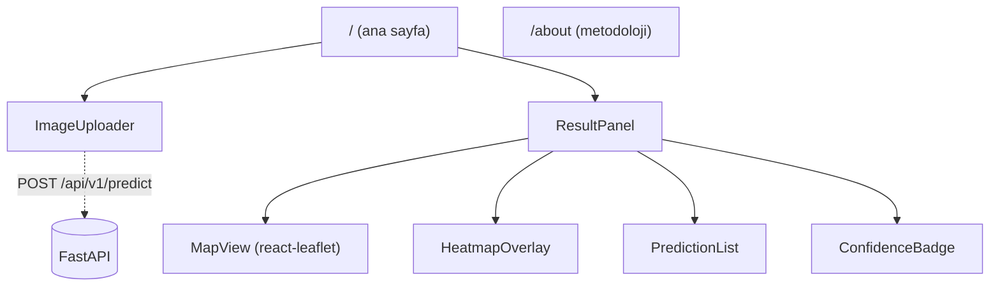

# MİM-3a: Frontend Mimarisi

> Plan/dokümantasyon. Uygulama kodu içermez.

## MVP: Gradio Bileşen Ağacı

## Gradio ↔ Backend Bağlantısı
| Yaklaşım | Değerlendirme |
|---|---|
| Service in-process çağrı | Hızlı; UI'yı iç API'ye bağlar, sözleşme test edilmez |
| **Gradio → FastAPI HTTP (localhost)** | ✓ Gerçek sözleşme; v2 Next.js drop-in; overhead ihmal |
| Ayrı process/port | Deploy karmaşıklığı |

**Öneri:** Gradio, FastAPI'ye HTTP ile bağlanır (aynı container; API `/api/v1`, UI `/ui` mount). Aynı sözleşme MVP+v2; full-stack sergisi; `/docs` vurgusu.

> Gradio'da yerleşik harita yok → **folium** (Leaflet) → `gr.HTML`. Alternatif: plotly scattermapbox / gradio_leaflet.

## v2: Next.js Sayfa/Komponent Haritası

## Leaflet Entegrasyonu (veri akışı)
`predictions[]` (lat/lon) → top-K marker, top-1 vurgu, bounds fit. Popup: referans küçük resim + similarity. Aliasing'de (risk #13) top-K yayılımı görünür. `is_confident=false` → "düşük güven" mesajı, heatmap yok (MİM-2 ile tutarlı).

### MİM-3a Özeti
Gradio Blocks (folium/Leaflet) → FastAPI HTTP; v2 Next.js react-leaflet drop-in; aynı API sözleşmesi.
