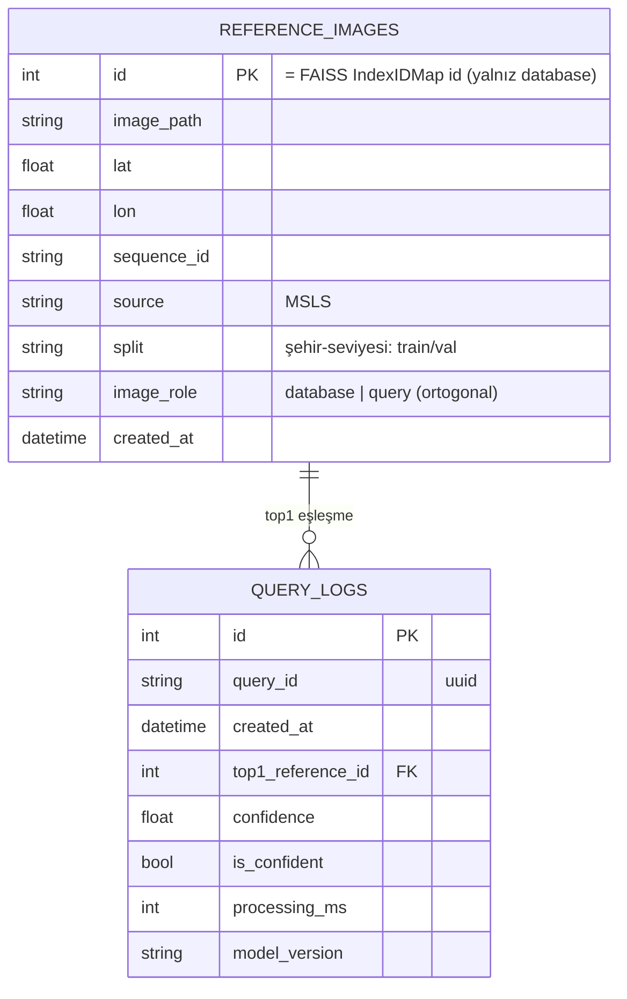

# MİM-3b: Veri Modeli / Veritabanı

> Plan/dokümantasyon. Gerçek şema DDL/kodu değil — tasarım taslağı.

## Tablolar
- **reference_images** — tüm MSLS Amsterdam görüntü metadata'sı. **`image_role`** ile `database` (referans/harita) veya `query` (sorgu) ayrılır. **Yalnızca `image_role='database'` satırları FAISS index'ine yazılır**; `query` satırları index'e girmez, `evaluate.py` (Recall@N) için tutulur.
- **query_logs** — (opsiyonel) canlı kullanıcı tahmini analitiği; **yüklenen görüntü SAKLANMAZ** (GDPR risk #35). (MSLS `query` görüntüleriyle karıştırılmamalı.)
- **Manifest** — JSON sidecar (`model_registry`), ana kaynak; `/model-info` okur (`index_size` = database görüntü sayısı).

> **Data leakage önlemi:** `image_role` boyutu, şehir-seviyesi `split` (train/val) boyutundan **ortogonaldir**. FAISS index'i yalnız `role=database` içerir → sorgu görüntüleri kendileriyle eşleşemez, Recall@N geçerli kalır (bkz. `03-ai-pipeline.md`).

## FAISS ↔ SQLite Eşleme
| Yaklaşım | Değerlendirme |
|---|---|
| Pozisyon = DB id | Basit; rebuild'de kırılgan |
| Ayrı id_map dosyası | Sağlam; ek senkron |
| **faiss.IndexIDMap over IndexFlatIP** | ✓ db_id gömülü; search db_id döner; ayrı dosya yok |

**Öneri:** `IndexFlatIP` → `faiss.IndexIDMap`; vektörler `reference_images.id` ile eklenir. Arama doğrudan `db_id` döner → SQLite metadata. Index sırası DB id'den bağımsız (rebuild güvenli).

## ER Diyagramı

### MİM-3b Özeti
IndexIDMap ile db_id gömülü eşleme; reference_images metadata; opsiyonel query_logs (görüntü saklamaz); manifest JSON sidecar.
