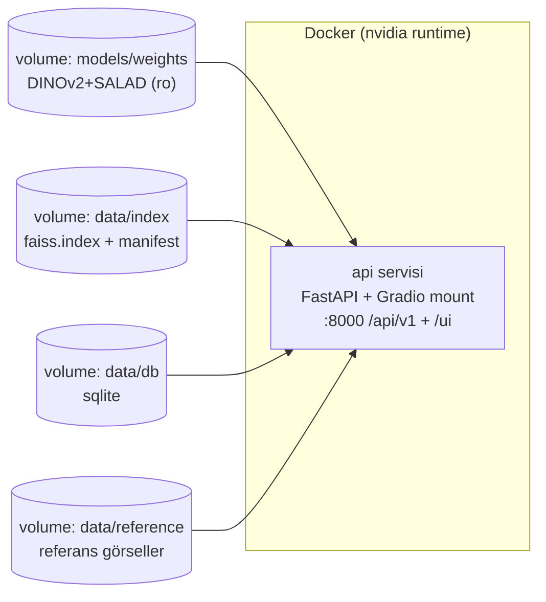

# MİM-4a: Deployment Mimarisi

> Plan/dokümantasyon. Gerçek Dockerfile/compose syntax'ı içermez.

## Docker Compose Servis Planı (kavramsal)

**MVP:** tek `api` servisi (FastAPI + mount Gradio). **v2:** `frontend`(Next.js) + `db`(PostGIS) + `qdrant` eklenir.

## Yerel vs HF Spaces
| | Yerel (RTX 4060) | HF Spaces |
|---|---|---|
| GPU | 8GB dedicated | ZeroGPU/T4 (kota); ücretsiz CPU |
| Yaşam döngüsü | Kalıcı | Boşta uyur, cold-start |
| Depolama | Yerel disk | ~50GB ücretsiz limit |
| Index/ağırlık | Yerel dosya | Startup'ta HF Hub'dan çekilir |
| Kullanım | Geliştirme, tam veri | Genel demo |

## Ağırlık + FAISS Index Taşıma
| Yaklaşım | Değerlendirme |
|---|---|
| Git LFS | Versiyonlu; kota/bant + repo şişer |
| **HF Hub (model/dataset repo)** | ✓ Büyük artifact için tasarlı; HF Spaces doğal; hf_hub_download |
| GitHub Release asset | Basit; CI/programatik erişim zayıf |

**Öneri: HF Hub.** DINOv2/SALAD zaten HF'te; MSLS-val (cph+sf) index → HF dataset repo, startup'ta çekilir. Git repo hafif. GitHub-only kalınırsa Git LFS yedek.

### MİM-4a Özeti
Tek container (FastAPI+Gradio) + volume'ler; yerel geliştirme + HF Spaces demo; artifact'lar HF Hub'dan.
