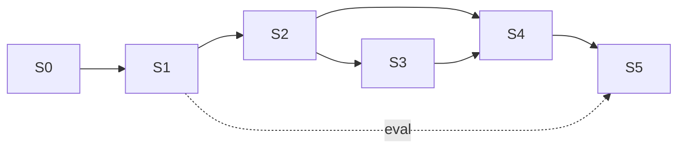

# MİM-4c: Sprint Planı

> Plan/dokümantasyon. Planlama birimi ~2 haftalık sprint (gerçek süre değişebilir). MVP ~6 sprint (~3 ay); 3-6 ay penceresi v2 için tampon.

| Sprint | Hedef | Çıktı | Bağımlılık | Kritik yol |
|---|---|---|---|---|
| **S0 — Kurulum & İskelet** | Repo, pyproject, config, CI, klasör, MSLS indirme scripti | Çalışan iskelet + veri | — | ✓ |
| **S1 — Embedding & Offline Index** | DINOv2+SALAD wrapper, build_index, role-split, IndexIDMap, SQLite, manifest | faiss.index + SQLite | S0 | ✓ |
| **S2 — Retrieval API** | lifespan yükleme, retrieval_service, /predict (heatmapsiz), /health, /model-info, hata yönetimi | Koordinat döndüren API | S1 | ✓ |
| **S3 — XAI & Güven** | Eigen-CAM xai_service, base64 heatmap, güven eşiği, global GPU semaphore | /predict heatmap+güven | S2 | kısmi |
| **S4 — Frontend (Gradio) & Harita** | Gradio Blocks, folium/Leaflet, top-K liste, heatmap, HTTP entegrasyon | Uçtan uca demo | S2 (S3 paralel) | ✓ |
| **S5 — Değerlendirme, Deploy & Portföy** | evaluate.py (**resmi MSLS-val protokolü, 740 sorgu cph+sf; eşik 25 m VE ≤40°**; Recall@N+km-hata), NetVLAD baseline'ı aynı val'de çalıştır, benchmark, Docker, HF Spaces, README+hero GIF+Mermaid | Canlı demo + benchmark + cilalı repo | S1(eval), S4(demo) | ✓ |

## Kritik Yol

`S0 → S1 → S2 → S4 → S5`. S3 (XAI) S2 sonrası kısmen paralel; S4 heatmap gösterimini besler. Eval S1'e bağlı.

### MİM-4c Özeti
6 sprint MVP; kritik yol S0→S1→S2→S4→S5; XAI paralelize edilebilir; eval S1 çıktısına bağlı.
